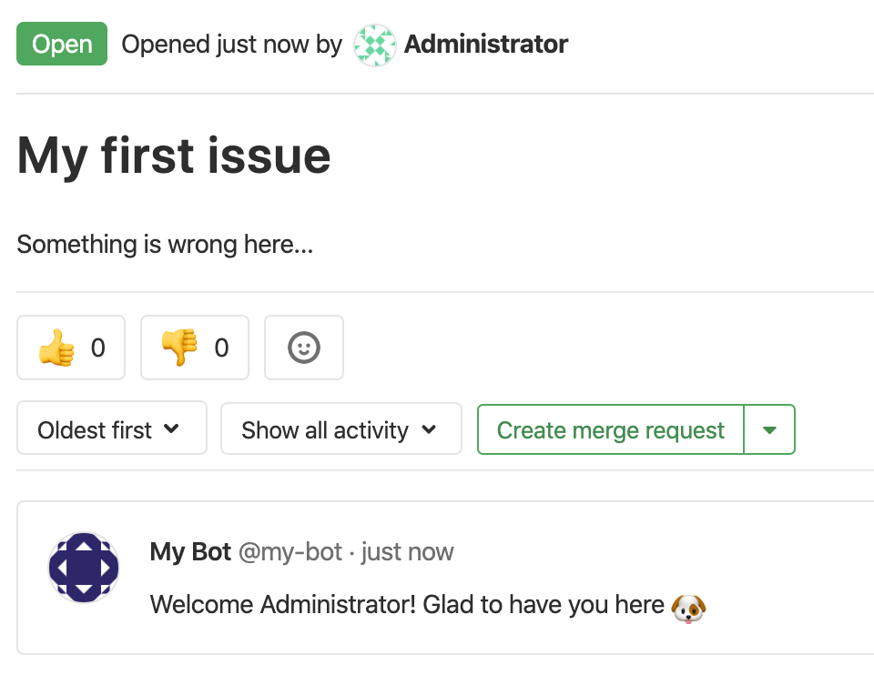

Now it is time to see fruit of our hard labour.

We created a bot that sends a message the first time a user creates an issue on a project. 

So let us test it out!

First let us logout of the Bot account. (It should only do bot things after all)

Then let us either create a new account, or just login again using our `root` account.

Now that we are logged in, navigate to the our project home page. 

`http://[[HOST_SUBDOMAIN]]-80-[[KATACODA_HOST]].environments.katacoda.com/root/PROJECTNAME`{{copy}}

Now click `Issues` on the left-side menu and create a `New issue`

Give it a title and some description. And submit it.

We should then see our Bot respond to us.

