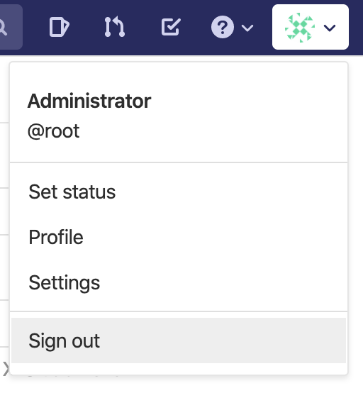
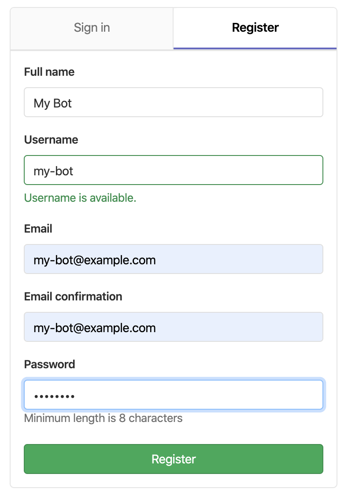

Now that GitLab is sending Issue events to our bot we want to make our bot able to interact with the GitLab API.

For this we need an access token. Now GitLab does not nativly have the concept of `Bots` like for example Github has. So we have two options here. 

The first option is that we use our normal account and try to make it clear that some of our actions are actually bot actions. This however usually leads to confusion as it becomes harder to see what is a bot action and what is a human actin. 

The second option which we will use in the tutorial is to create a new account that from which we perform all bot actions.

So to do this we must first logout. Under the menu from clicking your user icon in the right top corner.

We are now on the login page. Press register.

Give the bot a name, username and password. For email you can just use some @example.com email.

When naming a bot it is nice to try and make it clear that it is a robot and not a human. 
