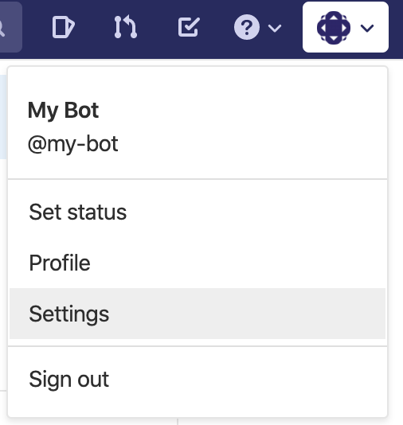
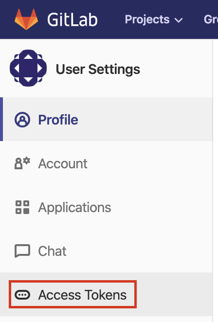

Now that we have our bot account we need to generate an access token so that we can authenicate our interactions with the GitLab API.

On your bot account navigate to the user settings. Under the menu from clicking your user icon in the right top corner.

Then click `Access Tokens` from the menu on the left side.

Now enter some name for the token and select `API` as its scope.

Press `Create personal access token`. The token is the generated is shown at the top of the page. Copy this token.

We can now exchange the placeholder token in the `.env` file to this token.