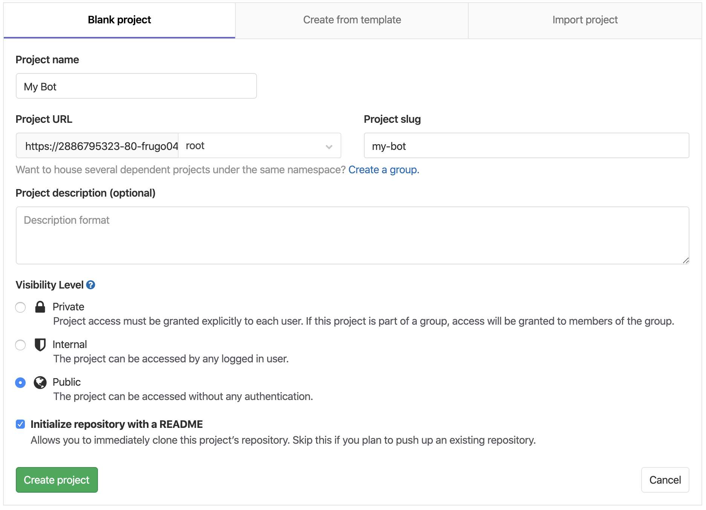

You are now logged in to a local GitLab instance.

Click `Create Project` and create a demo repo.

Give the repo a name and make the repo `Public` and let GitLab initialize it with a `README` file.

