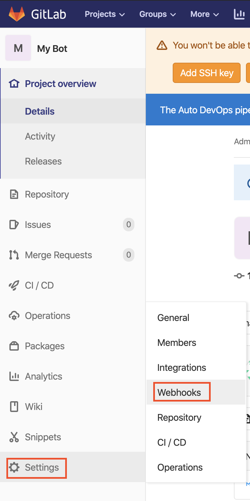
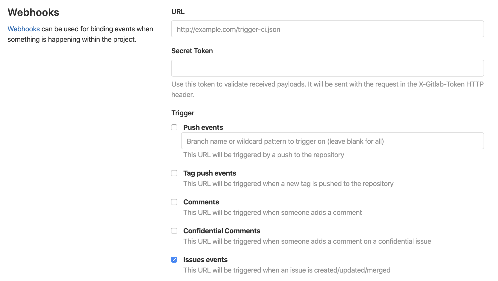

Now you should be on the overview page of the new repository you just created.

We will now add and configure the webhook so that our bot can recieve notifications from GitLab.

Navigate via `Settings > Webhook` from the menu on the left side

 
You should now see this page:

Set URL too: `https://[[HOST_SUBDOMAIN]]-5000-[[KATACODA_HOST]].environments.katacoda.com/`{{copy}}

And select that we want to recieve `Issue events`.

In a real bot application you would also want to set the secrets field. This is used to make it easier to validate that a request comes from your GitLab server. Github has a nice short [article](https://developer.github.com/webhooks/securing/) about the how and why of the webhook secret token field.